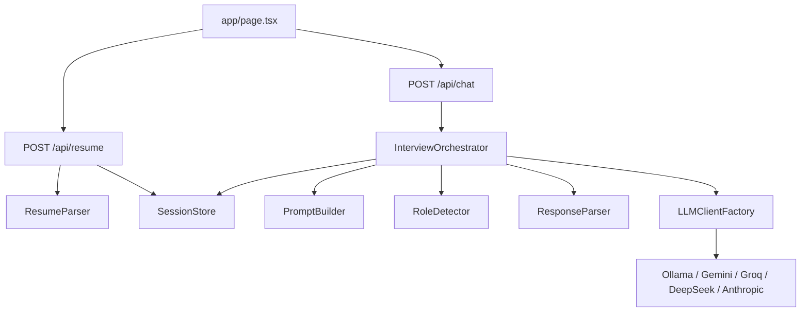

# Alex Interview Partner

Alex Interview Partner is an AI mock interview agent built for realistic interview practice. It supports role-based interview sessions, optional resume upload, browser voice input and output, adaptive follow-up questions, and structured scored feedback.

The product is designed around one core goal: make interview practice feel like a focused conversation with a strong interviewer, not a generic chatbot.

## What the app does

- Starts mock interviews for Software Engineer, Sales, Retail, and Generalist roles
- Lets users begin immediately without uploading a resume
- Uses an uploaded resume as optional context for role suggestions and question personalization
- Adapts to multiple user personas during the interview
- Produces a feedback scorecard with scores out of 10
- Supports multiple LLM providers through a swappable backend layer

## Assignment focus

This project was built to demonstrate four things clearly:

- Conversational quality
- Agentic behavior
- Technical implementation
- Intelligence and adaptability

The demo scenarios are structured around four separate user personas:

- Confused User
- Efficient User
- Chatty User
- Edge Case User

Keeping each persona in a separate session makes the adaptation easier to evaluate and keeps each feedback scorecard meaningful.

## Core features

- Role-based mock interviews without requiring a resume
- Optional PDF or TXT resume upload
- Resume-aware role suggestions
- Adaptive follow-up questions
- Voice input using the Web Speech API
- Voice output using `speechSynthesis`
- Structured feedback and scorecard output
- Provider-flexible LLM integration

## Tech stack

- Frontend: Next.js App Router, React, Tailwind CSS
- Backend: Next.js API routes
- Voice input: `SpeechRecognition` / `webkitSpeechRecognition`
- Voice output: `speechSynthesis`
- Local model support: Ollama
- Cloud model support:
  - Gemini
  - Groq
  - DeepSeek
  - Anthropic

## Quick start

### 1. Open the project

```powershell
cd C:\Users\LENOVO\Downloads\BLOOP_PROJECT\ai-interview-assistant
```

### 2. Install dependencies

```powershell
npm install
```

### 3. Create the local environment file

```powershell
Copy-Item .env.example .env.local
```

### 4. Choose one provider

Recommended for demo recording and stable local testing:

```env
LLM_PROVIDER=ollama
OLLAMA_BASE_URL=http://127.0.0.1:11434
OLLAMA_MODEL=llama3
```

Gemini:

```env
LLM_PROVIDER=gemini
GEMINI_API_KEY=your_gemini_api_key
GEMINI_MODEL=gemini-2.5-flash
```

Groq:

```env
LLM_PROVIDER=groq
GROQ_API_KEY=your_groq_api_key
GROQ_MODEL=llama-3.1-8b-instant
GROQ_BASE_URL=https://api.groq.com/openai/v1
```

DeepSeek:

```env
LLM_PROVIDER=deepseek
DEEPSEEK_API_KEY=your_deepseek_api_key
DEEPSEEK_MODEL=deepseek-v4-flash
DEEPSEEK_BASE_URL=https://api.deepseek.com
```

Anthropic:

```env
LLM_PROVIDER=anthropic
ANTHROPIC_API_KEY=your_anthropic_api_key
ANTHROPIC_MODEL=claude-sonnet-4-20250514
```

### 5. Start the app

```powershell
npm run dev
```

Open:

```text
http://localhost:3000
```

If port `3000` is already in use, open the port shown by Next.js in the terminal output.

## Recommended local demo mode

For the most stable local demo, use Ollama:

1. Install Ollama from [ollama.com](https://ollama.com)
2. Pull a model

```powershell
ollama pull llama3
```

3. Make sure Ollama is running
4. Set `.env.local` to:

```env
LLM_PROVIDER=ollama
OLLAMA_BASE_URL=http://127.0.0.1:11434
OLLAMA_MODEL=llama3
```

5. Run:

```powershell
npm run dev
```

This mode is recommended for testing and recording because it avoids rate limits, credit issues, and cloud latency spikes.

## Product flow

The app supports two entry points:

1. Start directly without a resume
2. Upload a resume and get suggested roles first

Once the role is clear:

1. Alex asks what name to use for the candidate
2. Alex starts the mock interview
3. Alex adapts follow-ups based on response quality
4. Alex ends with structured feedback and score breakdowns

## Architecture

The app uses a thin frontend and a service-oriented backend flow.



### Main runtime responsibilities

- [page.tsx](</C:/Users/LENOVO/Downloads/BLOOP_PROJECT/ai-interview-assistant/app/page.tsx>)
  - renders chat UI
  - handles mic and speaker behavior
  - streams assistant responses
  - updates phase and scorecard state

- [app/api/chat/route.ts](</C:/Users/LENOVO/Downloads/BLOOP_PROJECT/ai-interview-assistant/app/api/chat/route.ts>)
  - receives chat messages
  - calls the orchestrator
  - streams SSE responses back to the browser

- [app/api/resume/route.ts](</C:/Users/LENOVO/Downloads/BLOOP_PROJECT/ai-interview-assistant/app/api/resume/route.ts>)
  - accepts resume uploads
  - parses resume content
  - stores resume text in the active session

- [InterviewOrchestrator.ts](</C:/Users/LENOVO/Downloads/BLOOP_PROJECT/ai-interview-assistant/lib/usecases/InterviewOrchestrator.ts>)
  - coordinates the interview flow
  - manages phase transitions
  - selects prompts
  - calls the active provider

- [PromptBuilder.ts](</C:/Users/LENOVO/Downloads/BLOOP_PROJECT/ai-interview-assistant/lib/services/PromptBuilder.ts>)
  - builds role-selection, resume, and interview prompts

- [ResponseParser.ts](</C:/Users/LENOVO/Downloads/BLOOP_PROJECT/ai-interview-assistant/lib/services/ResponseParser.ts>)
  - detects feedback/debrief output
  - extracts scorecards

- [RoleDetector.ts](</C:/Users/LENOVO/Downloads/BLOOP_PROJECT/ai-interview-assistant/lib/services/RoleDetector.ts>)
  - detects role intent from user messages

- [LLMClientFactory.ts](</C:/Users/LENOVO/Downloads/BLOOP_PROJECT/ai-interview-assistant/lib/services/LLMClientFactory.ts>)
  - selects the provider using `LLM_PROVIDER`

## Project structure

```text
app/
  api/
    chat/route.ts
    resume/route.ts
  globals.css
  layout.tsx
  page.tsx

lib/
  domain/
    InterviewSession.ts
  services/
    AnthropicLLMClient.ts
    DeepSeekLLMClient.ts
    GeminiLLMClient.ts
    GroqLLMClient.ts
    LLMClientFactory.ts
    OllamaLLMClient.ts
    OpenAICompatibleLLMClient.ts
    PromptBuilder.ts
    ResponseParser.ts
    ResumeParser.ts
    RoleDetector.ts
    SessionStore.ts
  usecases/
    InterviewOrchestrator.ts
  container.ts
  interfaces.ts
```

## Design decisions

### 1. Resume upload is optional

The main user journey is role-based interview practice. Resume upload is intentionally treated as an extra personalization layer rather than the default starting point.

### 2. Prompt-driven adaptation

Most of Alex's behavior is prompt-driven rather than hardcoded. The prompt is responsible for:

- asking one question at a time
- adapting to weak, average, or strong answers
- increasing difficulty over time
- staying in character
- redirecting off-topic users
- refusing out-of-scope requests
- ending with parseable feedback

### 3. Provider-flexible architecture

The LLM layer is hidden behind a shared interface. This makes the interview flow stable even when the underlying provider changes.

### 4. Local-first reliability

Ollama support was added because local demos are more reliable when they are not dependent on billing, quotas, or provider availability.

### 5. Phase-based state machine

The interview flow is modeled with explicit phases:

- `idle`
- `role_suggested`
- `interviewing`
- `debrief`

This keeps the flow easier to reason about and makes UI state more predictable.

### 6. SOLID-friendly service boundaries

The codebase uses a lightweight service structure:

- `InterviewOrchestrator` coordinates flow
- `PromptBuilder` builds prompts
- `ResponseParser` interprets outputs
- `RoleDetector` handles role intent
- provider clients only handle model communication

This separation keeps the system easier to extend and explain.

## Persona coverage

The system is designed to handle four persona styles:

### Confused User

- unsure which role to choose
- needs practical guidance and simpler framing

### Efficient User

- wants to move quickly
- prefers concise questions and faster difficulty escalation

### Chatty User

- gives long or off-topic answers
- needs warm redirection without losing conversational quality

### Edge Case User

- may provide invalid input
- may go off topic
- may ask for requests outside the assistant's capabilities
- should be redirected back into the interview without breaking character

## Deployment

### GitHub

Inside the project folder:

```powershell
git init
git add .
git commit -m "Build Alex Interview Partner"
git branch -M main
git remote add origin https://github.com/YOUR_USERNAME/ai-interview-assistant.git
git push -u origin main
```

Important:

- do not commit `.env.local`
- rotate any API keys that were exposed during testing or screenshots

### Vercel

1. Push the repo to GitHub
2. Import it into Vercel
3. Add the environment variables for the provider you want to use
4. Deploy

Example for Gemini:

```text
LLM_PROVIDER=gemini
GEMINI_API_KEY=...
GEMINI_MODEL=gemini-2.5-flash
```

Example for Groq:

```text
LLM_PROVIDER=groq
GROQ_API_KEY=...
GROQ_MODEL=llama-3.1-8b-instant
GROQ_BASE_URL=https://api.groq.com/openai/v1
```

Note:

- `ollama` is intended for local use unless you host your own Ollama server
- session state is currently stored in memory, so restarts clear active sessions

## Known limitations

- Session storage is in-memory only
- Voice input depends on browser support and microphone permissions
- Local model quality and latency depend on hardware
- Feedback extraction still depends on the provider roughly following the requested output format

## Recommended demo plan

For the cleanest assignment demo:

- use one stable provider consistently
- keep the four personas as four separate sessions
- show resume upload during the Efficient User flow
- show off-topic redirection during Chatty and Edge Case flows
- show the feedback scorecard at least once
